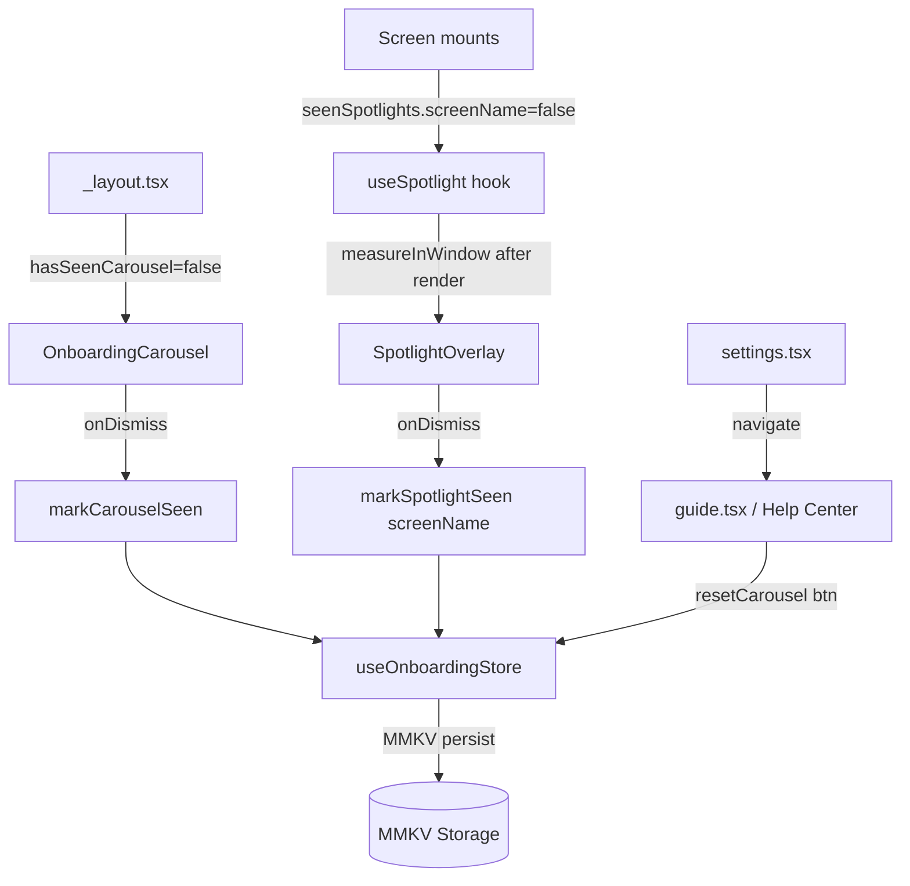

# Design Document

## Overview

為 Stitchie 新增完整的新手引導教學系統，包含三個獨立子系統：

1. **OnboardingCarousel** — 首次啟動時的全螢幕 Modal 輪播
2. **SpotlightOverlay** — 各畫面首次進入時的遮罩高亮提示
3. **Help Center (guide.tsx 擴充)** — 設定頁連結的完整功能說明頁

所有子系統共享同一個 `useOnboardingStore` 狀態，持久化至 MMKV。

## Steering Document Alignment

### Technical Standards
- 沿用 Zustand + MMKV persist 模式（與 `useSettingsStore`、`useProjectStore` 一致）
- 沿用 `StyleSheet.create`，不使用 NativeWind className
- 沿用 `useTranslation` 做多語言，新增 `onboarding` 和 `guide`（擴充）namespace key
- 動畫使用 React Native 內建 `Animated` API（與 `CompletionModal` 一致）
- 無新增 native module，不需 prebuild

### Project Structure
- 新 store：`src/stores/useOnboardingStore.ts`
- 新組件：`src/components/OnboardingCarousel.tsx`、`src/components/SpotlightOverlay.tsx`
- 新 hook：`src/hooks/useSpotlight.ts`
- 修改：`app/_layout.tsx`、`app/settings.tsx`、`app/guide.tsx`（擴充）
- 修改：6 個畫面整合 spotlight（每個畫面只加 2-5 行）
- 修改：`src/stores/mmkvStorage.ts`（新增 ONBOARDING key）
- 修改：`src/i18n/locales/*.ts`（新增翻譯 key）

## Code Reuse Analysis

### Existing Components to Leverage
- **`Modal`** (React Native built-in)：OnboardingCarousel 以全螢幕 Modal 渲染
- **`Animated` API** (React Native)：輪播頁間切換動畫、遮罩 fade-in
- **`useSettingsStore`**：`hasSeenMultiSelectHint` 已有相同的 persist 模式，直接複製結構建立 `useOnboardingStore`
- **`CompletionModal`**：提供 Animated.spring + Modal 的實作範例
- **`ScreenHeader`**：Help Center 畫面沿用
- **`guide.tsx`**：已存在且有完整結構，只需擴充內容與新增按鈕
- **`mmkvStorage.ts`**：只需新增一個常數

### Integration Points
- **`app/_layout.tsx`**：Lottie 播完後 (`onAnimationFinish`) 掛載 `<OnboardingCarousel>`
- **各畫面**：在 `useEffect` 中讀取 spotlight seen state，用 ref 測量目標元素後顯示 `<SpotlightOverlay>`
- **`app/settings.tsx`**：新增「使用說明」row，導向 `/guide`
- **`src/constants/analytics.ts`**：新增 `ROUND_EDITOR: 'RoundEditor'` 至 SCREEN_NAMES（補缺漏）

## Architecture



## Components and Interfaces

### `useOnboardingStore` (src/stores/useOnboardingStore.ts)

- **Purpose:** 持久化所有 tutorial 的已讀狀態
- **Interfaces:**
  ```ts
  interface OnboardingState {
    hasSeenCarousel: boolean
    seenSpotlights: Record<string, boolean>  // key = SCREEN_NAMES value
    markCarouselSeen: () => void
    markSpotlightSeen: (screenName: string) => void
    resetCarousel: () => void  // for "重新觀看教學" button
  }
  ```
- **Dependencies:** Zustand, MMKV, `mmkvStorage`, `STORAGE_KEYS`
- **Reuses:** 完全複製 `useSettingsStore` 的 persist 模式

### `OnboardingCarousel` (src/components/OnboardingCarousel.tsx)

- **Purpose:** 首次啟動的全螢幕介紹輪播
- **Interfaces:**
  ```ts
  interface OnboardingCarouselProps {
    visible: boolean
    onDismiss: () => void
  }
  ```
- **Implementation:**
  - 使用 `Modal` (transparent=false, animationType='fade')
  - 內部維護 `currentIndex: number` state
  - 使用 `FlatList` with `horizontal`, `pagingEnabled`, `scrollEnabled={false}` — 透過程式控制翻頁（避免用戶在 slides 間任意滑動，改用按鈕控制）
  - 實際導航：`flatListRef.current?.scrollToIndex({ index: next })`
  - 底部頁碼點：依 `currentIndex` 渲染填色點
  - Slides 定義為 const 陣列（在組件外）：
    ```ts
    interface CarouselSlide {
      iconName: string          // Ionicons or Feather icon name
      titleKey: string          // i18n key
      descriptionKey: string    // i18n key
    }
    const SLIDES: CarouselSlide[] = [...]  // 5 slides
    ```
- **Dependencies:** React Native Modal, FlatList, Animated, useTranslation, Ionicons
- **Reuses:** 無現有可複用組件，但結構簡單

### `SpotlightOverlay` (src/components/SpotlightOverlay.tsx)

- **Purpose:** 遮罩 + 高亮 + 說明泡泡的情境式提示
- **Interfaces:**
  ```ts
  interface TargetRect {
    x: number; y: number; width: number; height: number
  }
  interface SpotlightStep {
    targetRect: TargetRect
    title: string          // 已翻譯的文字（由 hook 傳入）
    description: string    // 已翻譯的文字
    shape?: 'circle' | 'rect'  // 預設 'rect'
    padding?: number           // 高亮區域邊距，預設 8
  }
  interface SpotlightOverlayProps {
    steps: SpotlightStep[]
    onDismiss: () => void
  }
  ```
- **Implementation（4-panel 遮罩法）：**
  - 全螢幕絕對定位 `View`（`position: 'absolute'`, `top: 0, left: 0, right: 0, bottom: 0`）
  - `zIndex: 9999`，攔截所有觸控
  - 以 4 個 `View` 組成遮罩（top/bottom/left/right panels）圍繞高亮區域：
    ```
    ┌────────────────────────────┐
    │         top panel          │
    ├────┬──────────────┬────────┤
    │left│   HIGHLIGHT  │ right  │
    ├────┴──────────────┴────────┤
    │        bottom panel        │
    └────────────────────────────┘
    ```
  - 高亮區域可選 `borderRadius: 8` (rect) 或 `borderRadius: halfSize` (circle)
  - 說明泡泡 (callout)：絕對定位，優先顯示在高亮區域下方；若下方空間不足則顯示上方
  - 入場動畫：`Animated.timing(opacityAnim, { toValue: 1, duration: 250 })`
  - 內部維護 `currentStep: number`
  - 「跳過」按鈕固定在右上角；「下一步/完成」按鈕在 callout 下方
- **Dependencies:** React Native Animated, useTranslation
- **Reuses:** 參考 `CompletionModal` 的 Animated 動畫模式

### `useSpotlight` (src/hooks/useSpotlight.ts)

- **Purpose:** 封裝 spotlight 的 ref 測量、seen 判斷、顯示邏輯
- **Interfaces:**
  ```ts
  interface SpotlightStepConfig {
    ref: React.RefObject<View>
    titleKey: string
    descriptionKey: string
    shape?: 'circle' | 'rect'
    padding?: number
  }

  function useSpotlight(
    screenName: string,
    steps: SpotlightStepConfig[]
  ): {
    showSpotlight: boolean
    resolvedSteps: SpotlightStep[]   // 含測量好的 targetRect
    dismiss: () => void
  }
  ```
- **Implementation:**
  - 讀取 `useOnboardingStore` 的 `seenSpotlights[screenName]`
  - 若未見過，在 `useEffect` 中用 `InteractionManager.runAfterInteractions` + 短延遲 (300ms) 後，對每個 ref 呼叫 `ref.current?.measureInWindow`
  - 若所有 ref 測量成功則設 `showSpotlight = true`
  - 若任一 ref 測量失敗（null 或 0,0,0,0）則跳過該步驟，不 crash
  - `dismiss()` 呼叫 `markSpotlightSeen(screenName)`
- **Dependencies:** `useOnboardingStore`, `InteractionManager`
- **Reuses:** 無，為新 hook

### Help Center (`app/guide.tsx` 擴充)

- **Purpose:** 完整功能說明頁，從設定進入，隨時可查閱
- **Interfaces:** 無 props（screen component）
- **Implementation:**
  - 保留現有結構（ScreenHeader + ScrollView + section/card/step 格式）
  - 在頂部新增「重新觀看教學」按鈕（primary outline style）
  - 擴充 sections：專案管理、織圖、段落編輯、計數追蹤、手勢操作、針法庫
  - 每個 section 改用 icon + title + description 格式（新增 `tip` 樣式）
- **Reuses:** 現有 `guide.tsx` 的所有 styles 和結構

## Data Models

### OnboardingState (MMKV persisted)
```
OnboardingState:
  hasSeenCarousel: boolean           // false = 顯示輪播
  seenSpotlights: {                  // key = SCREEN_NAMES 值
    "ProjectList": boolean,
    "ProjectDetail": boolean,
    "PatternEditor": boolean,
    "RoundEditor": boolean,
    "ProgressTracking": boolean,
    "PatternElements": boolean,
  }
```

### CarouselSlide (compile-time constant)
```
CarouselSlide:
  iconName: string      // Feather/Ionicons icon name
  titleKey: string      // i18n key → onboarding.slide1Title etc.
  descriptionKey: string
```

### SpotlightStep (runtime, resolved from refs)
```
SpotlightStep:
  targetRect: { x, y, width, height }  // from measureInWindow
  title: string        // already-translated text
  description: string
  shape: 'circle' | 'rect'
  padding: number
```

## Screen Integration Pattern

每個有 spotlight 的畫面遵循同一模式（以 Chart Editor 為例）：

```tsx
// 1. 建立 refs
const addRoundBtnRef = useRef<View>(null)
const roundRowRef = useRef<View>(null)
const dragHandleRef = useRef<View>(null)

// 2. 定義 steps config
const spotlightSteps: SpotlightStepConfig[] = [
  { ref: addRoundBtnRef, titleKey: 'onboarding.editorAddRoundTitle', descriptionKey: 'onboarding.editorAddRoundDesc' },
  { ref: roundRowRef, titleKey: 'onboarding.editorLongPressTitle', descriptionKey: 'onboarding.editorLongPressDesc' },
  { ref: dragHandleRef, titleKey: 'onboarding.editorDragTitle', descriptionKey: 'onboarding.editorDragDesc' },
]

// 3. 使用 hook
const { showSpotlight, resolvedSteps, dismiss } = useSpotlight(SCREEN_NAMES.PATTERN_EDITOR, spotlightSteps)

// 4. 在 JSX 中加 ref 到目標元素
<TouchableOpacity ref={addRoundBtnRef} ...>...</TouchableOpacity>

// 5. 渲染 overlay（放在 SafeAreaView 最後）
{showSpotlight && <SpotlightOverlay steps={resolvedSteps} onDismiss={dismiss} />}
```

## Error Handling

### Error Scenarios

1. **ref.measureInWindow 回傳 (0,0,0,0)**
   - **Handling:** `useSpotlight` 過濾掉此步驟，不顯示或跳過
   - **User Impact:** 用戶看不到該步驟，不影響其他步驟

2. **畫面尚未完全 layout**
   - **Handling:** 使用 `InteractionManager.runAfterInteractions()` + 300ms delay 再測量
   - **User Impact:** 無，透明延遲

3. **所有 refs 測量失敗**
   - **Handling:** `useSpotlight` 不顯示 overlay，直接呼叫 `markSpotlightSeen`
   - **User Impact:** 用戶不看到 spotlight，但不 crash

4. **MMKV 讀寫失敗**
   - **Handling:** Zustand persist middleware 已有 error boundary；預設值為 `false`（不影響功能）
   - **User Impact:** 最壞情況：每次開 App 都看到 carousel，重啟後恢復正常

## Testing Strategy

### Unit Testing
- `useOnboardingStore`：測試 markCarouselSeen / markSpotlightSeen / resetCarousel 的狀態轉換
- `useSpotlight`：mock measureInWindow，測試 seen 判斷、ref 失敗降級

### Integration Testing
- Carousel 顯示邏輯：`hasSeenCarousel=false` 時顯示，`true` 時不顯示
- Spotlight 顯示邏輯：初次進入顯示，再次進入不顯示

### End-to-End Testing
- 首次啟動 → 看到 carousel → 點 "開始使用" → carousel 消失 → 進入 project list → 看到 spotlight
- 重啟 App → 不再看到 carousel
- 設定 → 使用說明 → 點「重新觀看教學」→ 重啟 → 看到 carousel
